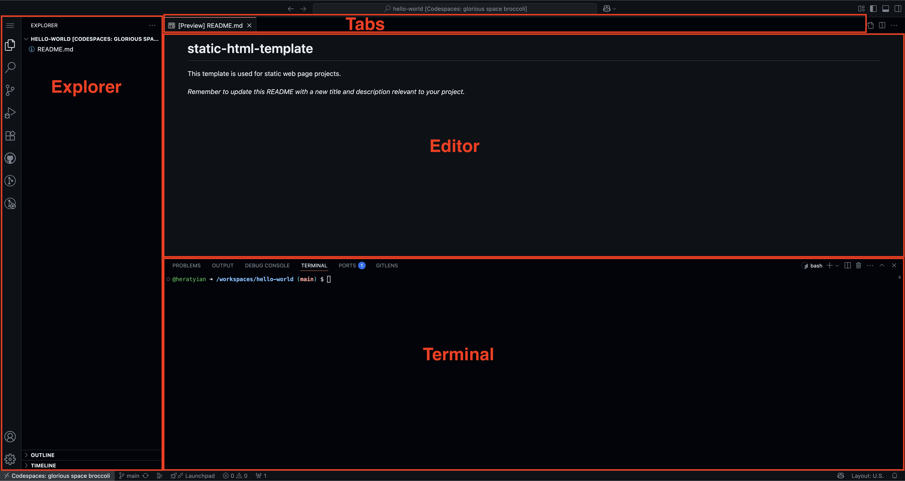
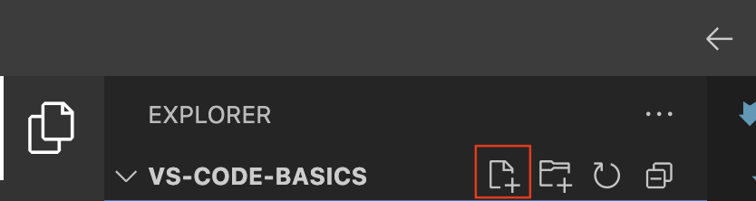
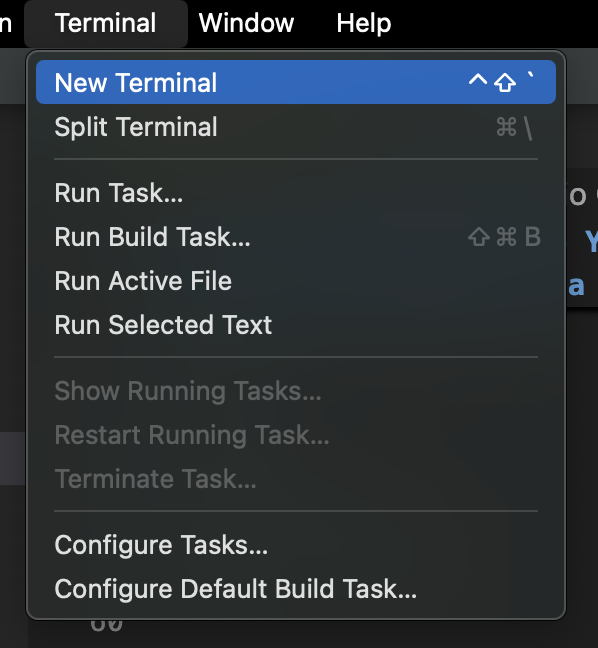
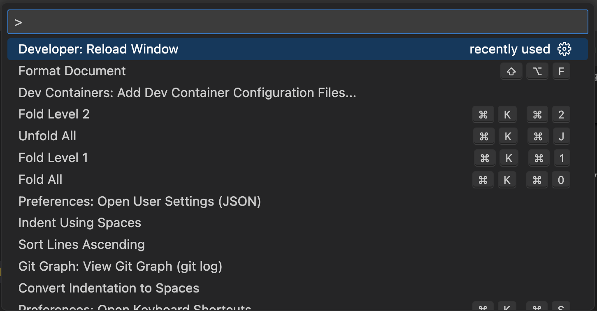
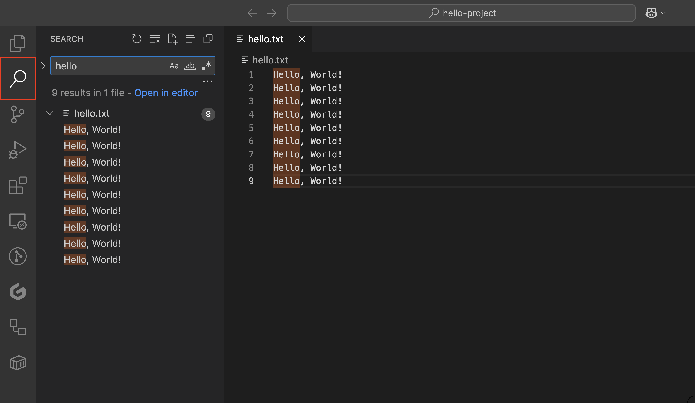

# Visual Studio Code: A Deeper Look

Visual Studio Code is one of the most popular code editors in the world. It's fast, flexible, and packed with features that help you write, run, and debug code more easily no matter what language you're using.

## Goal

By the end of this lesson, you’ll learn the essential features of VS Code, explore powerful tips and keyboard shortcuts to boost efficiency, and pick up handy tricks to streamline your setup. By the end, you’ll be equipped with practical skills to code faster and more effectively in any project.

## 1(a). Use a Codespace


- Use the [Static HTML Template](https://github.com/dpi-tta-projects/static-html-template&template_owner=dpi-tta-projects) to create a new repository.
- Open your repository in a codespace.
- Move to [Step 2](#2-create-and-save-a-file)

## 1(b). Install VS Code

- Go to the official download page: [https://code.visualstudio.com](https://code.visualstudio.com)
- Download the installer for your OS (Windows, macOS, or Linux).
- Open the installer and follow the default prompts.
- Launch VS Code

<aside class="tip">
  On Windows, choose "Add to PATH" during setup. It makes launching VS Code from the terminal easier.
</aside>

### Open a Folder (Your Project Workspace)

Codespaces automatically creates a folder for your workspace, but you need to create your own workspace when running locally.

<video src="assets/open-project-workspace.mp4" autoplay loop muted playsinline></video>

Let’s make a place for your code. Open your terminal and run:

```bash
mkdir hello-project
cd hello-project
```

Now open it in VS Code:

```bash
code .
```

<aside class="tip">
  If <code>code .</code> doesn’t work, open VS Code and press <code>⌘ + Shift + P</code> (Mac) or <code>Ctrl+Shift+P</code> (Win/Linux) in VS Code, type <code>shell command</code>, and select <strong>Install 'code' command in PATH</strong>. If this still doesn't work, try clicking <strong>Uninstall 'code' command from PATH</strong> first, then installing again.
</aside>

VS Code will open your new folder as a project workspace.

## 2. Create and Save a File



Let's start off by creating a new file in VS Code.



Open the VS Code explorer sidebar and click the New File icon in the Explorer sidebar.

<aside class="tip">
 Another approach to quickly creating a file is to right click anywhere in the explorer and select "New File...".
</aside>

Name it: `hello.txt`

Type:

```txt
Hello, VS Code!
```

Press `⌘ + S` (Mac) or `Ctrl + S` (Win/Linux) to save.

<aside class="tip">
  Files you create in VS Code are saved directly into your project folder. No extra setup needed.
</aside>

## 3. Use the Integrated Terminal



Open the terminal inside VS Code:

- Go to the top menu: Terminal > New Terminal (or press Ctrl + \`)

You’ll now see a terminal at the bottom of the window. Try:

```bash
ls
```

You should see:

`hello.txt`

<aside class="tip">
  <strong>Shortcut:</strong> Press <code>Ctrl + `</code> (that’s the backtick key) or <code>⌘ + J</code> to quickly toggle the terminal.
</aside>

<aside class="tip">
  <strong>Shortcut:</strong> Press <code>ctrl + shift + `</code> to create new terminal instances.
</aside>

## 4. Use the Explorer to Navigate Your Project

The **Explorer sidebar** shows your files and folders. You can:

- Click to open files
- Right-click to rename, delete, or create new files/folders
- Drag files to move them

<aside class="tip">
  Press <code>⌘ + B</code> to show or hide the Explorer sidebar quickly.
</aside>

Leverage shortcuts to:

- Rename a file by clicking on it and pressing the return key
- Delete a file by click on it and pressing ⌘ + delete key

## 5. Use the Command Palette



The **Command Palette** lets you do almost anything by typing.

- Open it with: <code>⌘ + Shift + P</code> (Mac) or <code>Ctrl + Shift + P</code> (Windows/Linux)
- Try typing:
  - `theme` to change your editor theme
  - `terminal` to toggle or create a terminal
  - `Format Document` to auto-format your code

<aside class="tip">
  The Command Palette is especially useful when you don’t remember where a setting lives in the menu.
</aside>

## 6. Split the Screen to View Multiple Files

<video src="assets/split-screen.mp4" autoplay loop muted playsinline></video>

Want to see two files at once?

- Right-click a tab and choose **Split Right**
- Or drag a tab to the right side of the screen
- Shortcut: <code>⌘ + \</code> (Mac) or <code>Ctrl + \</code> (Win/Linux)

You can work in both panes simultaneously (great for comparing files or writing HTML and CSS side-by-side).

## 7. Searching Text

Need to find some text? Press <code>⌘ + F</code> (or <code>Ctrl + F</code>) to search in the **current file**

Press `Enter` to cycle through each occurence or `Shift + Enter` to cycle backwards.

You can also use **Replace (`⌘ + option + F`)** to update text across files. Press `Enter` to replace and/or `⌘ + Enter` to replace all occurences.

<video src="assets/find-and-replace.mp4" autoplay loop muted playsinline></video>

### Search Globally

Press <code>⌘ + Shift + F</code> (or <code>Ctrl + Shift + F</code>) to search **across your whole project**



## 8. Move Code Without Copy/Paste

Need to reorder lines of code?

- Place your cursor on a line and press:
  - <code>Option + ↑ / ↓</code> (Mac)
  - <code>Alt + ↑ / ↓</code> (Windows/Linux)

This moves the entire line up or down. Super helpful when organizing code!

Press `option + shift + ↓` to duplicate the current line. (This also works for up ↑)

<video src="assets/copy-line.mp4" autoplay loop muted playsinline></video>

## Shortcuts to Know

| Shortcut	                   | What It Does                         |
| ---------------------------- | ------------------------------------ |
| ⌘ + S                        | Save the current file                |
| ⌘ + P                        | Quickly open any file in the project |
| ⌘ + /                        | Toggle a comment on a line           |
| ⌘ + Shift + P                | Open the Command Palette             |
| ⌘ + B                        | Show/hide sidebar                    |
| ⌘ + \` (backtick)            | Toggle terminal                      |
| ⌘ + Shift + \\               | Jump to matching bracket             |
| ⌘ + D                        | Select next matching word            |
| ⌘ + K, then ⌘ + S            | Open keyboard shortcuts menu         |
| ⌘ + Shift + E                | Focus the Explorer                   |

Use `Ctrl` in place of `⌘` on Windows/Linux.

## Practice Challenge

Try This:

- Create a new file named `notes.md`
- Write 3 lines of markdown text.
- Open the integrated terminal and list your files.
- Use the Command Palette to change your theme.
- Split the screen and open two files side-by-side.
- Try searching across your project with <code>⌘ + Shift + F</code>.
- Use <code>Option + ↓</code> to move a line in your markdown file.

## Wrap-Up

You’ve learned how to:

- Install and launch VS Code
- Open a project folder from the terminal
- Create and save files
- Use the integrated terminal
- Use time-saving shortcuts

## Quiz

- What does the `code .` command do?
- Opens the current folder in VS Code
  - Correct! It opens your project folder directly in the editor.
- Runs your code in the terminal
  - Not quite. It launches VS Code.
- Closes VS Code
  - Nope, that’s not what it does.
{: .choose_best #code_dot title="Opening a Folder with VS Code" answer="1" }

- Which are useful VS Code features?
- Integrated terminal
  - Correct! You can run shell commands right inside the editor.
- Built-in web browser
  - Nope! VS Code doesn’t have a browser.
- Extensions marketplace
  - Correct! You can install features for different languages and tools.
- Infinite scrolling
  - Not quite. That’s not specific to code editing.
{: .choose_all #features title="VS Code Features" answer="[1,3]" }

- What shortcut opens the Command Palette?
- ⌘/Ctrl + Shift + P
  - Correct! This lets you run almost any VS Code command.
- ⌘/Ctrl + P
  - Not quite. That opens the file search.
- ⌘/Ctrl + B
  - That toggles the sidebar.
{: .choose_best #command_palette title="VS Code Shortcuts" answer="1" }
